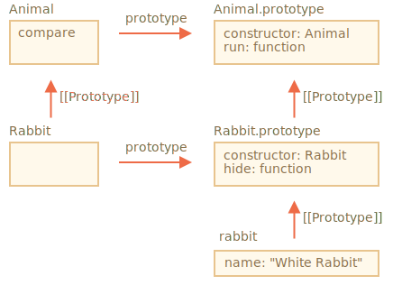

# Properti dan metode statis

Kita juga dapat menetapkan metode ke fungsi kelas itu sendiri, bukan ke `" prototipe "`-nya. Metode seperti itu disebut _static_.

Di dalam kelas, mereka ditambahkan oleh kata kunci `static`, seperti ini:

```js run
class User {
*!*
  static staticMethod() {
*/!*
    alert(this === User);
  }
}

User.staticMethod(); // true
```

Itu sebenarnya sama dengan menetapkannya sebagai properti secara langsung:

```js run
class User {}

User.staticMethod = function () {
  alert(this === User);
};

User.staticMethod(); // true
```

Nilai `this` dalam panggilan `User.staticMethod()` adalah konstruktor kelas `User` itu sendiri (aturan "object before dot").

Biasanya, metode statis digunakan untuk mengimplementasikan fungsi yang dimiliki kelas, tetapi tidak untuk objek tertentu darinya.

Misalnya, kita punya objek `Article` dan membutuhkan sebuah fungsi untuk membandingkan mereka. Solusi natural adalah menambahkan metode `Article.compare`, seperti ini:

```js run
class Article {
  constructor(title, date) {
    this.title = title;
    this.date = date;
  }

*!*
  static compare(articleA, articleB) {
    return articleA.date - articleB.date;
  }
*/!*
}

// penggunaan
let articles = [
  new Article("HTML", new Date(2019, 1, 1)),
  new Article("CSS", new Date(2019, 0, 1)),
  new Article("JavaScript", new Date(2019, 11, 1))
];

*!*
articles.sort(Article.compare);
*/!*

alert( articles[0].title ); // CSS
```

Di sini `Article.compare` berdiri "di atas" _articles_, sebagai alat untuk membandingkannya. Ini bukan metode _article_, melainkan seluruh kelas.

Contoh lain adalah apa yang disebut metode "factory". Bayangkan, kita butuh beberapa cara untuk membuat _article_:

1. Buat dengan parameter yang diberikan (`title`, `date` dsb).
2. Buat _article_ kosong dengan tanggal hari ini.
3. ...atau yang lainnya.

Cara pertama dapat diterapkan oleh konstruktor. Dan untuk yang kedua kita bisa membuat metode statis kelas.

Seperti `Article.createTodays()` di sini:

```js run
class Article {
  constructor(title, date) {
    this.title = title;
    this.date = date;
  }

*!*
  static createTodays() {
    // ingat, this = Article
    return new this("Today's digest", new Date());
  }
*/!*
}

let article = Article.createTodays();

alert( article.title ); // Today's digest
```

Sekarang setiap kali kita perlu membuat _today's digest_, kita dapat memanggil `Article.createTodays()`. Sekali lagi, itu bukan metode _article_, tapi metode seluruh kelas.

Metode statis juga digunakan dalam kelas terkait basis data untuk mencari/menyimpan/menghapus entri dari basis data, seperti ini:

```js
// dengan asumsi Article adalah kelas khusus untuk mengelola articles
// metode statis untuk menghapus article:
Article.remove({ id: 12345 });
```

## Properti Statis

[recent browser=Chrome]

Properti statis juga dimungkinkan, mereka terlihat seperti properti kelas biasa, tetapi diawali dengan `static`:

```js run
class Article {
  static publisher = 'Ilya Kantor';
}

alert(Article.publisher); // Ilya Kantor
```

Itu sama dengan penugasan langsung ke `Article`:

```js
Article.publisher = 'Ilya Kantor';
```

## Pewarisan properti dan metode statis

Properti dan metode statis diwarisi.

Misalnya, `Animal.compare` dan `Animal.planet` dalam kode di bawah ini diwariskan dan dapat diakses sebagai `Rabbit.compare` dan `Rabbit.planet`:

```js run
class Animal {
  static planet = "Earth";

  constructor(name, speed) {
    this.speed = speed;
    this.name = name;
  }

  run(speed = 0) {
    this.speed += speed;
    alert(`${this.name} runs with speed ${this.speed}.`);
  }

*!*
  static compare(animalA, animalB) {
    return animalA.speed - animalB.speed;
  }
*/!*

}

// Mewarisi dari Animal
class Rabbit extends Animal {
  hide() {
    alert(`${this.name} hides!`);
  }
}

let rabbits = [
  new Rabbit("White Rabbit", 10),
  new Rabbit("Black Rabbit", 5)
];

*!*
rabbits.sort(Rabbit.compare);
*/!*

rabbits[0].run(); // Black Rabbit runs with speed 5.

alert(Rabbit.planet); // Earth
```

Sekarang kita dapat memanggil `Rabbit.compare`, yang diwariskan `Animal.compare` akan dipanggil.

Bagaimana cara kerjanya? Sekali lagi, menggunakan prototipe. Seperti yang mungkin sudah kamu duga, `extends` memberi `Rabbit` sebagai `[[Prototype]]` mengacu kepada `Animal`.



Jadi, `Rabbit extends Animal` membuat dua acuan `[[Prototype]]`:

1. `Rabbit` fungsi _prototypally_ mewarisi dari fungsi `Animal`.
2. `Rabbit.prototype` _prototypally_ mewarisi dari `Animal.prototype`.

Hasilnya, pewarisan berfungsi baik untuk metode reguler dan statis.

Di sini, mari kita periksa dengan kode:

```js run
class Animal {}
class Rabbit extends Animal {}

// untuk statis
alert(Rabbit.__proto__ === Animal); // true

// untuk metode reguler
alert(Rabbit.prototype.__proto__ === Animal.prototype); // true
```

## Ringkasan

Metode statis digunakan untuk fungsionalitas yang termasuk dalam kelas "secara keseluruhan". Ini tidak terkait dengan instance kelas konkret.

Sebagai contoh, metode perbandingan `Article.compare(article1, article2)` atau metode _factory_ `Article.createTodays()`.

Mereka diberi label dengan kata `static` dalam deklarasi kelas.

Properti statis digunakan ketika kita ingin menyimpan data tingkat kelas, juga tidak terikat pada sebuah _instance_.

Sintaksnya adalah:

```js
class MyClass {
  static property = ...;

  static method() {
    ...
  }
}
```

Secara teknis, deklarasi statis sama dengan menetapkan ke kelas itu sendiri:

```js
MyClass.property = ...
MyClass.method = ...
```

Properti dan metode statis diwarisi.

Untuk `class B extends A` prototipe dari kelas `B` itu sendiri menunjuk ke `A`: `B.[[Prototype]] = A`. Jadi jika bidang tidak ditemukan di `B`, pencarian dilanjutkan di `A`.
