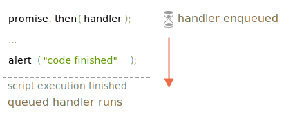

# Microtasks

Handler-handler promise `.then`/`.catch`/`.finally` selalu asynchronous.

Bahkan ketika sebuah promise diresolve, kode pada baris _di bawah_ `.then`/`.catch`/`.finally` masih akan dieksekusi sebelum handler-handler ini.

Berikut demo-nya:

```js run
let promise = Promise.resolve();

promise.then(() => alert("promise done!"));

alert("code finished"); // alert ini muncul lebih dahulu
```

Jika anda menjalankannya, anda melihat `code finished` lebih dahulu, dan kemudian `promise done!`.

Itu aneh, karena promise pasti _done_ dari awal.

Mengapa `.then` terpicu setelahnya? Apa yang sedang terjadi?

## Antrean Microtasks


Task asynchronous membutuhkan manajemen yang tepat. Untuk itu, standar menentukan antrean internal `PromiseJobs`, lebih sering disebut sebagai "antrean microtask" (istilah v8).

Seperti yang dikatakan di [spesifikasi](https://tc39.github.io/ecma262/#sec-jobs-and-job-queues):

- Antrean adalah yang pertama masuk-pertama keluar: tasks yang diantrekan pertama dijalankan terlebih dahulu.
- Eksekusi dari task dimulai jika hanya tidak ada yang berjalan.


<<<<<<< HEAD
Atau, untuk mengatakannya secara sederhana, ketika promise sudah siap, handler-handler `.then/catch/finally` ini dimasukkan kedalam antrean. Handler-handler tersebut belum dieksekusi. Mesin JavaScript mengambil task dari antrean dan menjalankannya, ketika sudah bebas dari kode saat ini.
=======
Or, to put it more simply, when a promise is ready, its `.then/catch/finally` handlers are put into the queue; they are not executed yet. When the JavaScript engine becomes free from the current code, it takes a task from the queue and executes it.
>>>>>>> 6ab384f2512902d74e4b0ff5a6be60e48ab52e96

Itulah kenapa "code finished" pada contoh di atas muncul lebih dahulu.




Handler-handler promise selalu melalui antrean internal.

<<<<<<< HEAD
Jika ada chain dengan banyak `.then/catch/finally`, maka masing-masing dieksekusi secara asynchronous. Artinya, itu pertama kali masuk ke antrean, dan dieksekusi ketika kode saat ini sudah selesai dan antrean handler-handler sebelumnya sudah selesai.
=======
**What if the order matters for us? How can we make `code finished` appear after `promise done`?**
>>>>>>> 6ab384f2512902d74e4b0ff5a6be60e48ab52e96

**Bagaimana jika urutan penting untuk kita? Bagaimana kita membuat `code finished` berjalan setelah `promise done`?**


Mudah, letakkan saja di dalam antrean dengan `.then`:

```js run
Promise.resolve()
  .then(() => alert("promise done!"))
  .then(() => alert("code finished"));
```

Sekarang urutannya seperti yang diinginkan.

## Rejection yang tidak tertangani

Ingat event `unhandledrejection` dari bab <info:promise-error-handling>?

Sekarang kita bisa melihat bagaimana sebenarnya JavaScript menemukan bahwa ada rejection yang tidak tertangani.

**"Rejection yang tidak tertangani" muncul ketika error promise tidak ditangani di akhir antrean microtask.**

Biasanya, jika kita mengharapkan error, kita menambahkan `.catch` ke chain promise untuk menangani error tersebut:

```js run
let promise = Promise.reject(new Error("Promise Failed!"));
*!*
promise.catch(err => alert('caught'));
*/!*

// tidak berjalan: error ditangani
window.addEventListener('unhandledrejection', event => alert(event.reason));
```


...Tetapi jika kita lupa menambah `.catch`, kemudian, setelah antrean microtask sudah kosong, mesin memicu event:


```js run
let promise = Promise.reject(new Error("Promise Failed!"));

// Promise Gagal!
window.addEventListener("unhandledrejection", (event) => alert(event.reason));
```

Bagaimana jika kita menangani error tersebut nanti? Seperti ini:

```js run
let promise = Promise.reject(new Error("Promise Failed!"));
*!*
setTimeout(() => promise.catch(err => alert('caught')), 1000);
*/!*

// Error: Promise Gagal!
window.addEventListener('unhandledrejection', event => alert(event.reason));
```


Sekarang, jika anda menjalankannya, kita akan melihat pesan `Promise Failed!` terlebih dahulu, dan kemudian `caught`.

Jika kita tidak tahu tentang antrean microtasks, kita bisa bertanya-tanya: "Mengapa handler `unhandledrejection` berjalan? Kita menangkap error!".

Tetapi sekarang kita mengerti bahwa `unhandledrejection` dihasilkan saat antrean microtask selesai: mesin memeriksa promise dan, jika ada promise yang berada di state "rejected", maka event akan dipicu.

Pada contoh di atas, `.catch` ditambahkan oleh `setTimeout` juga pemicu, tetapi kemudian, setelah `unhandledrejection` telah terjadi, jadi itu tidak mengubah apapun.


## Ringkasan

Penanganan promise selalu asynchronous, karena semua aksi promise melewati antrean internal "promise jobs", juga dipanggil "antrean microtask" (istilah v8).

Jadi, handler-handler `.then/catch/finally` selalu dipanggil setelah kode saat ini selesai.

Jika kita butuh untuk menjamin kalau potongan kode dieksekusi setelah `.then/catch/finally`, kita bisa menambahnya kedalam panggilan chain `.then`.


Di sebagian besar mesin Javascript, termasuk peramban dan Node.js, konsep microtasks terkait erat dengan "event loop" dan "macrotasks". Karena ini tidak berhubungan langsung dengan promise, konsep-konsep tersebut akan dibahas di bagian lain pada tutorial, dalam bab <info:event-loop>.
