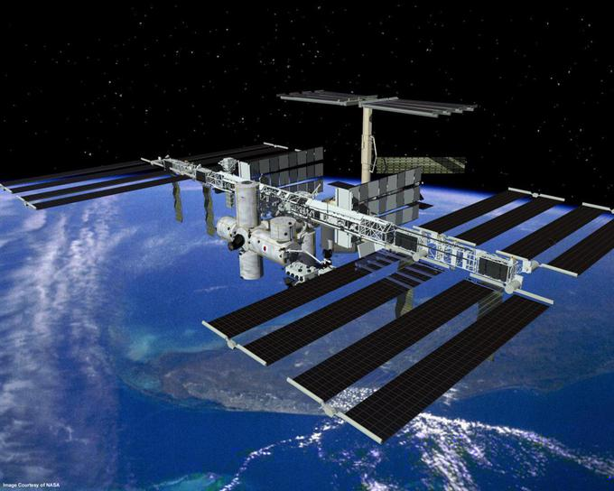
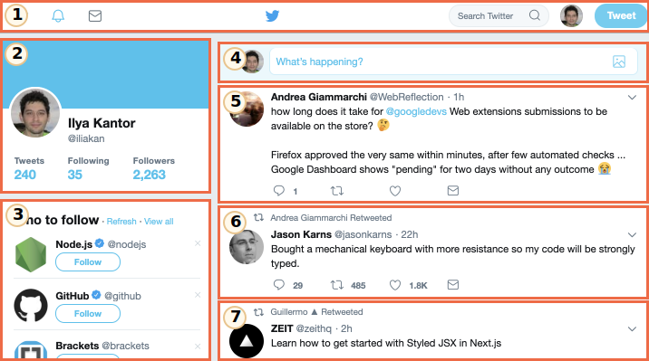

# Dari Ketinggian Orbital

Bagian ini menjelaskan seperangkat standar modern untuk "komponen web".

Sampai sekarang, standar ini sedang dalam pengembangan. Beberapa fitur didukung dengan baik dan terintegrasi
ke dalam standar HTML/DOM modern, sementara yang lainnya masih dalam tahap konsep. Anda dapat mencoba contohnya 
di peramban apa pun, Google Chrome mungkin yang paling muktahir dengan fitur-fitur ini. Coba tebak, itu karena
rekan Google berada di balik banyaknya spesifikasi terkait.

## Apa yang sama di antaranya...

Ide keseluruhan komponen bukanlah hal baru. Ini digunakan dalam banyak kerangka kerja dan di tempat lain.

Sebelum kita beralih ke detail implementasi, lihatlah pencapaian besar umat manusia ini:

Itu adalah Stasiun Luar Angkasa Internasional (ISS).

Dan ini adalah bagaimana di dalamnya dibuat (kira-kira):

Stasiun Luar Angkasa Internasional:
- Terdiri dari banyak komponen.
- Setiap komponen, pada bagiannya, memiliki banyak detail kecil di dalamnya.
- Komponennya sangat kompleks, jauh lebih rumit dibanding kebanyakan situs web.
- Komponennya dikembangkan secara internasional, oleh tim dari berbagai negara, yang berbicara dalam bahasa yang berbeda.

...Dan benda ini terbang, membuat manusia tetap hidup di luar angkasa!

Bagaimana perangkat rumit seperti itu dibuat?

Prinsip mana yang bisa kita pinjam agar membuat pengembangan kita pada tingkat yang sama handal dan terukur? Atau, setidaknya, mendekati.

## Component architecture

The well known rule for developing complex software is: don't make complex software.

If something becomes complex -- split it into simpler parts and connect in the most obvious way.

**A good architect is the one who can make the complex simple.**

We can split user interface into visual components: each of them has own place on the page, can "do" a well-described task, and is separate from the others.

Let's take a look at a website, for example Twitter.

It naturally splits into components:

1. Top navigation.
2. User info.
3. Follow suggestions.
4. Submit form.
5. (and also 6, 7) -- messages.

Components may have subcomponents, e.g. messages may be parts of a higher-level "message list" component. A clickable user picture itself may be a component, and so on.

How do we decide, what is a component? That comes from intuition, experience and common sense. Usually it's a separate visual entity that we can describe in terms of what it does and how it interacts with the page. In the case above, the page has blocks, each of them plays its own role, it's logical to make these components.

A component has:
- Its own JavaScript class.
- DOM structure, managed solely by its class, outside code doesn't access it ("encapsulation" principle).
- CSS styles, applied to the component.
- API: events, class methods etc, to interact with other components.

Once again, the whole "component" thing is nothing special.

There exist many frameworks and development methodologies to build them, each with its own bells and whistles. Usually, special CSS classes and conventions are used to provide "component feel" -- CSS scoping and DOM encapsulation.

"Web components" provide built-in browser capabilities for that, so we don't have to emulate them any more.

- [Custom elements](https://html.spec.whatwg.org/multipage/custom-elements.html#custom-elements) -- to define custom HTML elements.
- [Shadow DOM](https://dom.spec.whatwg.org/#shadow-trees) -- to create an internal DOM for the component, hidden from the others.
- [CSS Scoping](https://drafts.csswg.org/css-scoping/) -- to declare styles that only apply inside the Shadow DOM of the component.
- [Event retargeting](https://dom.spec.whatwg.org/#retarget) and other minor stuff to make custom components better fit the development.

In the next chapter we'll go into details of "Custom Elements" -- the fundamental and well-supported feature of web components, good on its own.
